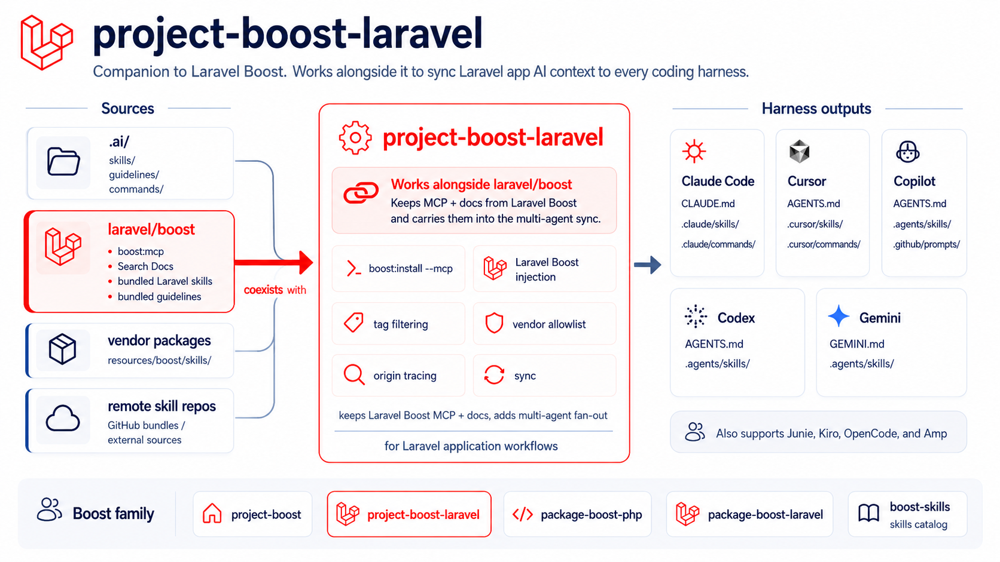

# project-boost-laravel

[](https://packagist.org/packages/sandermuller/project-boost-laravel)
[](https://github.com/sandermuller/project-boost-laravel/actions/workflows/run-tests.yml)
[](https://packagist.org/packages/sandermuller/project-boost-laravel)
[](LICENSE)
[](https://github.com/laravel/boost)

> The Laravel-application member of the boost family. It sits next to
> [`laravel/boost`](https://github.com/laravel/boost) in the same project.
> `laravel/boost` keeps doing what it already does — the MCP server, the Laravel
> docs API, its bundled Laravel skills — and this package takes over the
> agent-file fan-out, adding per-project filtering, remote skill sources, and
> origin tracing on top.

**Documentation: <https://sandermuller.github.io/boost-core/packages/project-boost-laravel/>**



You run `laravel/boost` and this package together. Neither replaces the other;
the design assumes they are installed side by side.

## What this adds on top of `laravel/boost`

Both tools write the same ten agents. What differs is the control you get over
what reaches them.

| | `laravel/boost` alone | With this package |
|---|---|---|
| MCP server, docs API, bundled Laravel skills | Yes | Unchanged |
| Tag filtering | — | `withTags()`. Ship `inertia-vue-development` only on Inertia projects |
| Remote skill sources | — | `withRemoteSkills()`. Pull GitHub-published `.skill` bundles |
| Vendor allowlist | Automatic, from `composer.json` | Explicit `withAllowedVendors()`, for collision control |
| Origin tracing | — | `boost where`, plus `project-boost:where` for the injected set |
| User-scope sync | — | `boost sync --scope=user`, for globally-installed CLI tools |
| Health check | — | `boost doctor --check-versions` |

## Install

```bash
composer require --dev sandermuller/project-boost-laravel
php artisan project-boost:install
```

`laravel/boost` and `sandermuller/boost-core` come in transitively. Do **not**
require `boost-core` separately.

`project-boost:install` wraps `boost:install --mcp`, so `laravel/boost` writes
its MCP client config exactly as it always does, then runs
`project-boost:sync` for the fan-out. It detects a non-TTY shell, so CI and
Docker need no extra flags.

> [!WARNING]
> Running `php artisan boost:install` **without** `--mcp` fires `laravel/boost`'s
> own guideline and skill writers, which then race this package over `CLAUDE.md`
> and the per-agent skill directories. Always go through `project-boost:install`.

Already have hand-edited agent files? Run `php artisan project-boost:reconcile`
once before syncing. It captures your edits into `.ai/guidelines/` and backs the
files up, so the markerless wholesale sync never drops them.

## Configuration

`boost.php` in the project root, or `.config/boost.php`:

```php
use SanderMuller\BoostCore\Config\BoostConfig;
use SanderMuller\BoostCore\Enums\Agent;
use SanderMuller\BoostCore\Enums\Tag;

return BoostConfig::configure()
    ->withAgents([Agent::CLAUDE_CODE, Agent::CURSOR, Agent::CODEX])
    ->withTags([Tag::Laravel, Tag::Php]);
```

Every `BoostConfig` method, the tag vocabulary, and the auto-sync hook are in the
[configuration guide](https://sandermuller.github.io/boost-core/packages/project-boost-laravel/configuration).

## Commands

| Command | Does |
|---|---|
| `project-boost:install` | Wraps `boost:install --mcp` and runs the sync. The recommended entry point |
| `project-boost:sync` | Discover, render, tag-filter, fan out. Run after `composer install` or a `boost.php` edit |
| `project-boost:sync --dry-run` | Preview the full pipeline in check mode |
| `project-boost:where` | The `laravel/boost` skills and guidelines this package injects, with ship / filtered / shadow status |
| `project-boost:reconcile` | Capture `laravel/boost`-seeded guidance into `.ai/guidelines/` before a sync would overwrite it |

## Documentation

| Topic | Page |
|---|---|
| What it adds, who owns which file, the architecture | [Overview](https://sandermuller.github.io/boost-core/packages/project-boost-laravel/) |
| Install, first run, troubleshooting | [Install](https://sandermuller.github.io/boost-core/packages/project-boost-laravel/install) |
| `boost.php`, auto-sync, `suppress_upstream_writers` | [Configuration](https://sandermuller.github.io/boost-core/packages/project-boost-laravel/configuration) |
| The canonical command sequence and the data-loss seam | [Coexistence with `laravel/boost`](https://sandermuller.github.io/boost-core/guide/laravel-coexistence) |
| Tags, skill dependencies, remote skills, conventions | [Guide](https://sandermuller.github.io/boost-core/guide/what-is-boost) |
| Every command and exit code | [CLI reference](https://sandermuller.github.io/boost-core/reference/cli) |

The semver-protected surface — the commands, the config keys, and the behaviour
this package guarantees — is in [`PUBLIC_API.md`](PUBLIC_API.md). It exposes no
`@api` PHP classes: the public contract is the commands and the config.

## Testing

```bash
composer test
```

Pest suite: unit tests for discovery, version resolution, and the
suppress-upstream listener, plus Testbench-backed feature tests for
`project-boost:install`'s TTY-versus-non-TTY branching.

`.github/workflows/ci-smoke.yml` runs the consumer install path end to end on
every push and pull request. It creates a fresh `laravel/laravel` application,
installs this package from the checkout, runs
`project-boost:install --no-sync --no-interaction` and asserts `.mcp.json` lands
with the `laravel-boost` server entry, then runs `project-boost:sync` and asserts
no Blade directives leak into the rendered output.

## License

MIT. See [LICENSE](LICENSE).

## Credits

- [Sander Muller](https://github.com/sandermuller)
- [`laravel/boost`](https://github.com/laravel/boost) for the MCP server, the bundled Laravel skills, and the per-agent `McpWriter` this package reuses.
- [`sandermuller/boost-core`](https://github.com/sandermuller/boost-core) for the sync engine this package extends.
